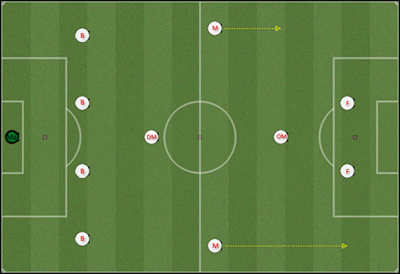

Tänkte berätta lite om den taktik jag använder mig av. Det är en form av 4-4-2 som jag utvecklat under de två första åren i Sevilla, och som åren efter gett stora framgångar utan några stora förändringar. Taktiken är väldigt offensiv och speluppbyggnaden är blandad mellan snabba kontringar när tillfälle ges, och kortpassningspel med tålamod. Tre positioner är särskilt viktiga:

- **Defensiva mittfältaren** – a.k.a. balansspelaren. Styr spelet och fördelar de viktiga bollarna ut mot kanterna eller i djupled. Håller sig ganska långt bak för att alltid vara möjlig för spel. Spelare på denna position: Alberto Roldán.
- **Offensiva mittfältaren** – eller släpande anfallare. Har en mycket viktig roll då mycket bollar letar sig fram till denne spelare. Platsbytet med ena anfallaren har gett en helt ny dimension till spelet och denna spelare gör väldigt mycket mål. Spelare på denna position: Jerônimo.
- **Högerbacken** – fyller allt som oftast på i anfallen, oftare med boll än vänsterbacken. Kondition krävs för löpningarna upp och ner längs kanten. Spelare på denna position: Dani Alves, Rafael Riera.

I försvar är det hög press från anfallarna. Resten av spelarna kör zon-markering och backar hem. Försvaret ligger ganska högt och här krävs nickskickliga spelare, då anfallarnas press ofta leder till långboll på forward. Den defensive mittfältaren tar stort ansvar i försvaret och städar undan allt framför backlinjen.

I anfall stannar tre spelare lite längre bak, mittbackarna och balansspelaren. Ytterbackar fyller på på kanten, vänsta anfallaren möter boll, högra sticker på djupet. På högerkanten finns oftast två spelare väldigt högt upp, medan vänsterkanten slår mer tidiga inlägg. Offensiva mittfältaren snappar ofta upp returer, eller kommer i full fart utan markering på inlägg. Vid inlägg befinner sig nästan alltid tre spelare i boxen. Så här ser taktiken ut på pappret.

Troligaste startelvan 2014/15:  
Zattin | Alves – Maduro – Digard – Adriano | Roldán | Cruz – Jerônimo – Anderson | Navas – Torres

<figure>
  
</figure>
