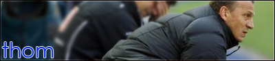

- TRÄNINGSMATCH | Boby Brno, b | 4-0 | Filippini, Cortés (2), Jerônimo
- TRÄNINGSMATCH | Almería, b | 7-0 | Torres (4), Anderson (2), Jerônimo
- SUPERCUPEN | Celta, b | 4-0 | Cortés (2), Jerônimo (2)
- TRÄNINGSMATCH | Ferrol, b | 0-0 |
- SUPERCUPEN | Celta, h | 3-0 | Cortés, Alves, Filippini

### Träningsmatcher

Tjeckien-turnén avslutades mot Boby Brno, och Filippini ledde laget till en 4-0 seger. Riktigt bra match av nyförvärvet som spelade som Cruz gjorde när han var som bäst. Vi laddade sen upp inför Celta i supercupen med en 7-0-seger över Almería. Jag fick laget att utnyttja kanterna mycket mer, och både Filippini och Cruz spelade riktigt bra. Ett frågetecken är dock platsen bredvid Torres. Både Navas och Cortés känns som osäkra kort. Torres imponerade kraftigt, med faktum kvarstår att han behöver backup. Två dagar innan returen mot Celta avslutade vi träningsmatcherna med en väldigt reservbetonad match mot Ferrol. Och det märktes att det inte var några extrema vinnarskallar i laget. 0-0 slutade matchen och inte många spelare gjorde något avtryck. 16-årige Antonio Gil fick dock chansen på det defensiva mittfältet och stod för en bra match.

### Spanska supercupen

Första matchen i Vigo gjorde vi en strålande insats. Vi arbetade som ett lag i både anfall och försvar, och inte en spelare gjorde en dålig insats. Skönt att se Cortés göra två mål igen. Hemma spelade vi inte lika bra men vann lätt med 3-0, trots en man mindre sen en övertaggad Aragón blivit utvisad precis innan halvtid. Men segrare var vi och ännu en titel var bärgad.

### Silly Season

Jag fortsatte att jaga Adamo, men tyskarna höll hårt i sin guldklimp. Så hårt att de nekade bud på €56M. Under tiden som jag förhandlade med Hertha försökte jag som vanligt låna ut så många av de som inte tillhör absoluta toppen. Det blev inte så många i år. Melero, Tassi och Martínez Jiménez är utlånade till Celta, Ejido samt Córdoba. Tillslut stängde fönstret och det blev inga mer värvningar. Kanske får vi se något nytt i vinter.

<figure>
  
  <figcaption><strong>ANDREAS THOM</strong>, tränare i Hertha, höll hårt i guldklimpen Adamo.</figcaption>
</figure>
