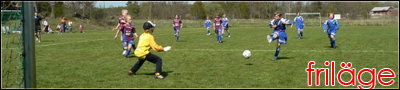

- PRIMERA DIVISIÓN | Levante, h | 0-1 |
- PRIMERA DIVISIÓN | Villarreal, b | 3-1 | Adriano, Jerônimo, Montes
- CHAMPIONS LEAGUE | Benfica, b | 10-0 | Jerônimo (2), Alexandre (sj), Cortés (2), Roldán, Montes (3), Oliveira (sj)
- PRIMERA DIVISIÓN | Ejido, b | 4-0 | Palmer, Jerônimo (2), Montes
- PRIMERA DIVISIÓN | Barcelona, b | 0-1 |
- CHAMPIONS LEAGUE | Benfica, h | 2-0 | Jerônimo, Cortés

### Primera División

Och så var säsongens första ligaförlust ett faktum. Pinsamt och uselt spel mot ett dåligt Levante. På hemmaplan dessutom. Anfallarna är riktigt ojämna, framför allt Montes, som kan göra kanonmatcher, men blandar det med kalkoninsatser. Villarreal och Ejido besegrades enkelt, men hela tiden hade vi problem med frilägen. Chanser framför mål som gick in nio gånger av tio förra säsongen missas nu hela tiden, något som verkligen syntes mot Barcelona. Vi tryckte på men vägrade hitta luckorna bredvid van der Steen. Gäller väl bara att låta anfallarna vänja sig vid lägena tills de börjar göra mål. Men fortsätter det så här kan det gå illa.

<figure>
  
  <figcaption><strong>FRILÄGESAVSLUTEN</strong> är just nu väldigt ofta på pojklagsnivå.</figcaption>
</figure>

### Champions League

Benfica blev rejält överkörda där anfallarna visade tvivlarna att de hade haft fel. Otroligt underhållande match med många konstiga mål och bjudningar från Benficas försvar. Returen på hemmaplan blev inte lika målrik, men vinst blev det i alla fall. 2-0 och chans att testa lite nya spelidéer.
