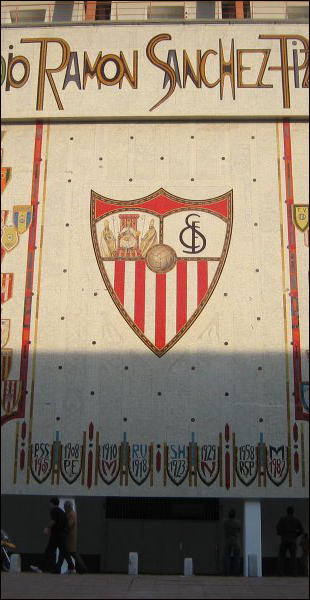

Här kommer en screenpresentation av samtliga spelare i A-truppen, samt de mest lovande talangerna.

- 1\. [Anderson](../images/anderson-1.png)
- 2\. [Riera](../images/riera-1.png)
- 3\. [A Montes](../images/montes-1.png)
- 4\. [Aragón](../images/aragon-1.png) – egen talang
- 5\. [Palmer](../images/palmer-1.png)
- 6\. [Roldán](../images/roldan-1.png) – egen talang
- 7\. [Filippini](../images/filippini-1.png)
- 8\. [Anderson](../images/anderson-2.png)
- 9\. [Cortés](../images/cortes-1.png) – egen talang
- 10\. [Jerônimo](../images/jeronimo-1.png)
- 11\. [J Montes](../images/jcmontes-1.png)
- 12\. [Ramos](../images/ramos-1.png)
- 13\. [Alves](../images/alves-1.png)
- 16\. [García](../images/garcia-1.png) – egen talang
- 17\. [Herrera](../images/herrera-1.png) – egen talang
- 18\. [Ruiz](../images/ruiz-1.png) – egen talang
- 19\. [Moreno](../images/moreno-1.png) – egen talang
- 20\. [Rodrigues](../images/rodrigues-1.png) – egen talang
- 21\. [Rico](../images/rico-1.png)
- 22\. [Torres](../images/torres-1.png)
- 23\. [Cossu](../images/cossu-1.png) – egen talang
- 24\. [Márquez](../images/marquez-1.png) – egen talang
- 25\. [Faivre](../images/faivre-1.png) – egen talang
- 26\. [Melero](../images/melero-1.png) – egen talang

##### Utanför eller på väg in i A-truppen:

- [Valdés](../images/valdes-1.png) – egen talang
- [Maduro](../images/maduro-1.png)
- [Padilla](../images/padilla-1.png) – egen talang
- [Barrientos](../images/barrientos-1.png) – egen talang
- [Guerra](../images/guerra-1.png) – egen talang
- [Gil](../images/gil-1.png) – egen talang
- [A Montes](../images/amontes-1.png) – egen talang
- [Molina](../images/molina-1.png) – egen talang
- [Delgado](../images/delgado-1.png) – egen talang
- [Silva](../images/silva-1.png) – egen talang
